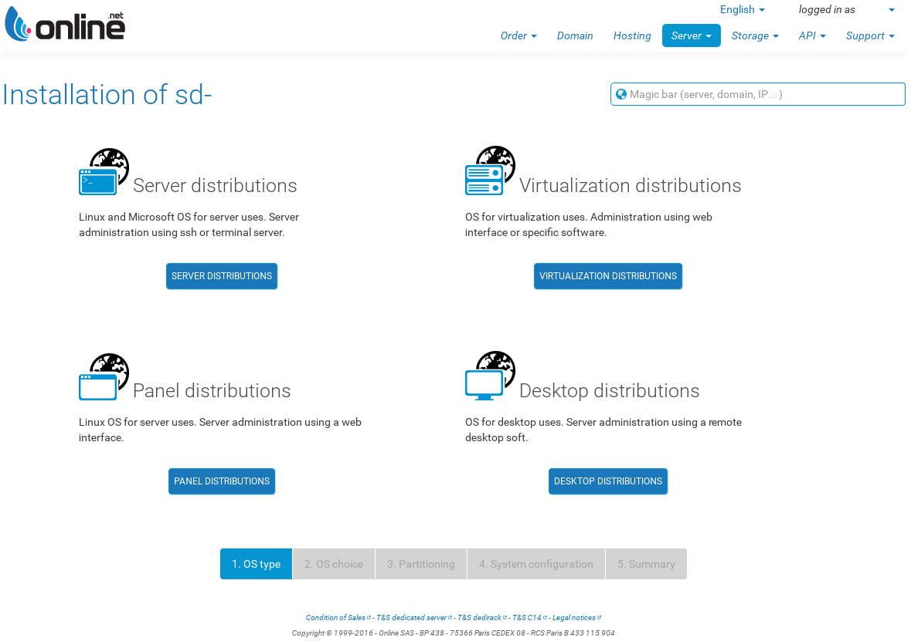
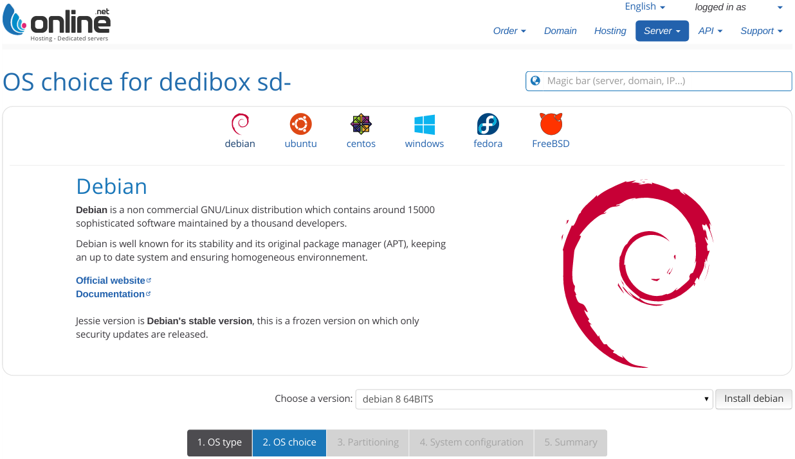
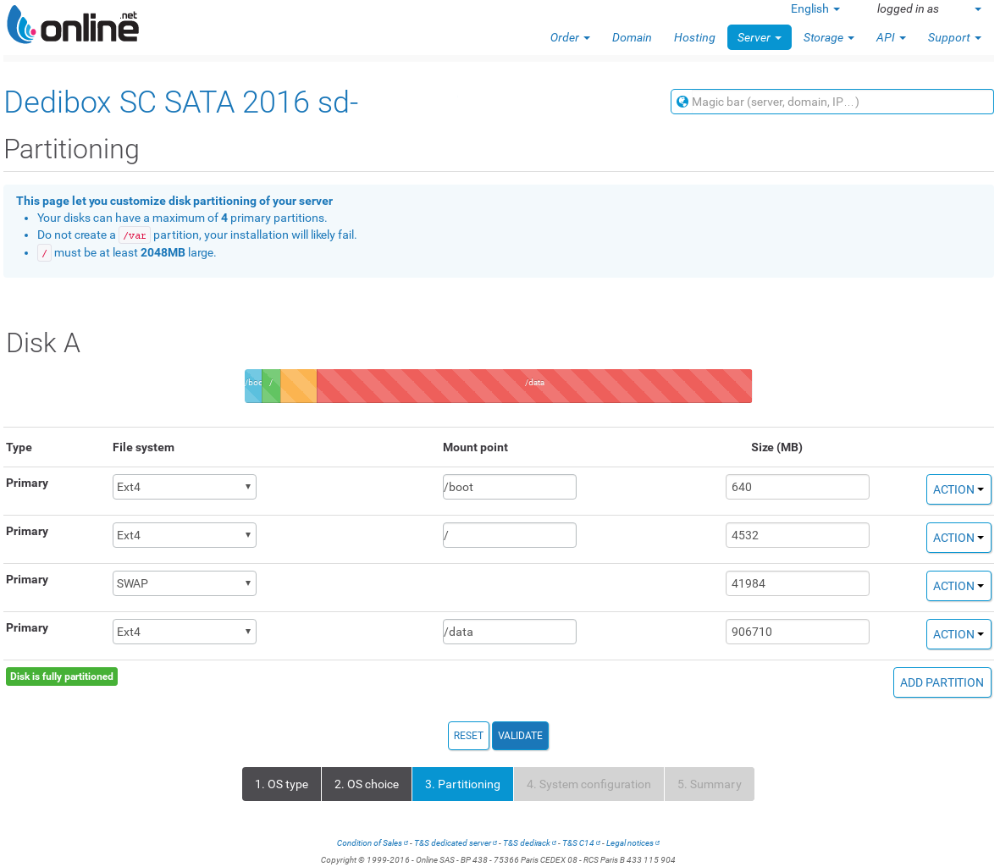

<!-- -*- mode:markdown;tab-width:2;indent-tabs-mode:nil;coding:utf-8 -*-
     vim: ft=markdown syn=markdown fileencoding=utf-8 sw=2 ts=2 ai eol et si
     README.md: Dedibox Fully Encrypted Debian installation
     (c) 2011-16 Laurent Vallar <val@zbla.net>, WTFPL license v2 see below.

     This program is free software. It comes without any warranty, to
     the extent permitted by applicable law. You can redistribute it
     and/or modify it under the terms of the Do What The Fuck You Want
     To Public License, Version 2, as published by Sam Hocevar. See
     http://www.wtfpl.net/ for more details.
  -->

# Dedibox Fully Encrypted Debian Install

## TL;DR

1. Do a normal Debian server install but use swap partition as root filesystem.
2. After the first boot crypt other partitions but `/boot`.
3. Install new root filesystem on crypted target.
4. Do some stuff to get all workging after next reboot.
5. Reboot and log in with `ssh` while in boot process (`initramfs`+`dropbear`).
6. Decrypt all then log out.
7. Enjoy your fully encrypted Debian system.

## Final objectives

All partition but _/boot_ will be encrypted. Current partition layout is
based on disk space available for a Dedibox SC SATA 2016, i.e. 1x500 Go SSHD.

| Type     | Initial mount point | Size      | After install | encrypted |
|:---------|:--------------------|----------:|:--------------|-----------|
| Primary  | /boot (Ext4)        |    640 Mo | /boot (Ext4)  | no        |
| Primary  | / (Ext4)            |   4532 Mo | _Swap_        | **yes**   |
| Primary  | _Swap_              |  41984 Mo | / (Ext4)      | **yes**   |
| Primary  | /data (Ext4)        | 906710 Mo | /data (Ext4)  | **yes**   |

## Online.net classical install

### Server OS type

### Distribution

### Online.net installation console screenshot

_Online.net_ installation partitioning is a little buggy : if free space is left
swap partition will get all remaining space. That's why I created an
fourth primary partition to handle properly available free space.

After that you will be prompted for accounts credentials, **don't forget to
upload your SSH public key**: see below.

### Generate a dropbear compatible SSH key pair

As **dropbear** does not support ED25519 we have to build an RSA key pair.

~~~~
key_date=$(date +%Y-%m-%d)
key_name=${USER}@$(hostname)_${key_date}
ssh-keygen -t rsa -b 4096 -f ~/.ssh/id_rsa_${key_name} -C ${key_name}
~~~~

## Prepare encryption

### Store SSH host keys

~~~~~
ssh-keyscan -H <your_dedibox_IP_or_FQDN> >> ~/.ssh/known_hosts
~~~~~

### Log in as root and cleanup Online.net installation & shutdown all services

~~~~~
apt-get remove -y --purge bind9 bind9utils
rm -rf /var/cache/bind
for daemon in openntpd udev cron rsyslog systemd-journald dbus getty@tty1; do
  systemctl stop $daemon
  systemctl disable $daemon
done
~~~~~

### Disable swap & umount configured /data

~~~~~
swapoff -a
umount /data
~~~~~

### Save actual partitioning

~~~~
sfdisk -d /dev/sda > sda.sfdisk
~~~~

### Change encrypted partition types

~~~~
sed -e 's|^\(.*, Id=\)8[23]$|\1da|g' -i sda.sfdisk
~~~~

### Apply partition types modification

~~~~~
sfdisk --no-reread --force /dev/sda < sda.sfdisk
rm -f sda.sfdisk
apt-get install -y parted
partprobe
~~~~~

### Encrypt future root and use /data mount point temporarily

~~~~~
/bin/echo -e "console-setup\tconsole-setup/charmap47\tselect\tUTF-8\n\
console-setup\tconsole-setup/codesetcode\tstring\tguess\n\
console-setup\tconsole-setup/codeset47\tselect\tGuess optimal character set" |\
debconf-set-selections
apt-get install -y cryptsetup
cryptsetup luksFormat /dev/sda3
cryptsetup luksOpen /dev/sda3 sda3_crypt
mkfs.ext4 -j -m 0.1 -L ROOT \
  -O dir_index,extent,filetype,sparse_super,huge_file /dev/mapper/sda3_crypt
mount /dev/mapper/sda3_crypt /data
~~~~~

## Install new system

### Do a fresh install on new encrypted root

~~~~~
debian_mirror=http://http.debian.net/debian
debian_codename=stretch # change with target distribution
debootstrap_base_url=${debian_mirror}/pool/main/d/debootstrap
debootstrap_version=\
$(wget ${debootstrap_base_url} -q -O - |\
  egrep 'debootstrap_.*_all.deb' |\
  sed -e 's/^.*>debootstrap_\(.*\)_all\.deb<.*$/\1/g' |\
  sort |tail -n 1)
wget -c -q ${debootstrap_base_url}/debootstrap_${debootstrap_version}_all.deb
dpkg -i debootstrap_*_all.deb
debootstrap ${debian_codename} /data ${debian_mirror}
~~~~~

### Prepare SSH root connection for later use

~~~~~
cp -a /root/.ssh /data/root/.
~~~~~

## Make new system bootable

### Chroot into encrypted root

~~~~~
umount /boot
mount -o bind /sys /data/sys
mount -o bind /proc /data/proc
mount -o bind /dev /data/dev
mount -o bind /dev/pts /data/dev/pts
mount -o bind /run /data/run
mount -o bind /run/lock /data/run/lock
mount -o bind /run/shm /data/run/shm
chroot /data
export TERM=xterm-color
export LANG=C.UTF-8
export LC_ALL=C.UTF-8
~~~~~

### Configure Apt

~~~~~
cat <<EOF> /etc/apt/sources.list
deb http://deb.debian.org/debian/ stretch main contrib non-free
#deb-src http://deb.debian.org/debian/ stretch main contrib non-free

#deb http://security.debian.org/ stretch/updates main contrib non-free
#deb-src http://security.debian.org/ stretch/updates main contrib non-free

# stretch-updates, previously known as 'volatile'
#deb http://deb.debian.org/debian/ stretch-updates main contrib non-free
#deb-src http://deb.debian.org/debian/ stretch-updates main contrib non-free

# stretch-backports, previously on backports.debian.org
#deb http://deb.debian.org/debian/ stretch-backports main contrib non-free
#deb-src http://deb.debian.org/debian/ stretch-backports main contrib non-free
EOF
cat <<EOF> /etc/apt/apt.conf.d/30disable-recommends-and-suggests
APT::Install-Recommends "0";
APT::Install-Suggests "0";
EOF
cat <<EOF> /etc/apt/apt.conf.d/99disable-translations
APT::Acquire::Languages "none";
EOF
~~~~~

### Install cryptsetup inside new root

~~~~~
/bin/echo -e "console-setup\tconsole-setup/charmap47\tselect\tUTF-8\n\
console-setup\tconsole-setup/codesetcode\tstring\tguess\n\
console-setup\tconsole-setup/codeset47\tselect\tGuess optimal character set" |\
debconf-set-selections
apt-get update
apt-get -y install cryptsetup console-setup
apt-get -y autoremove
apt-get clean
~~~~~

### Encrypt future /data and configure crypttab

~~~~~
cryptsetup luksFormat /dev/sda4
cryptsetup luksOpen /dev/sda4 sda4_crypt
mkfs.ext4 -j -m 0 -L DATA \
  -O dir_index,extent,filetype,sparse_super,huge_file /dev/mapper/sda4_crypt
cat <<EOF>> /etc/crypttab
# encrypted swap
sda2_crypt /dev/sda2 /dev/urandom cipher=aes-cbc-essiv:sha256,size=256,swap
# encrypted root
sda3_crypt UUID=`cryptsetup luksUUID /dev/sda3` none luks
# encrypted /data
sda4_crypt UUID=`cryptsetup luksUUID /dev/sda4` none luks
EOF
# Force cryptsetup
sed -e 's/^\(#\)\?\(CRYPTSETUP=\).*$/\2y/g' \
  -i /etc/cryptsetup-initramfs/conf-hook
~~~~~

### Create fstab

~~~~~
cat <<EOF> /etc/fstab
# /etc/fstab: static file system information.
#
# Use 'blkid' to print the universally unique identifier for a
# device; this may be used with UUID= as a more robust way to name devices
# that works even if disks are added and removed. See fstab(5).
#
# <file system> <mount point>   <type>  <options>       <dump>  <pass>

# /boot on /dev/sda1
UUID=`blkid -s UUID -o value /dev/sda1` /boot ext4 defaults 0 2

# swap on /dev/mapper/sda2_crypt (encrypted /dev/sda2)
/dev/mapper/sda2_crypt none swap sw 0 0

# root on /dev/mapper/sda3_crypt (encrypted /dev/sda3)
UUID=`blkid -s UUID -o value /dev/mapper/sda4_crypt` / ext4 errors=remount-ro \
0 1

# data on /dev/mapper/sda4_crypt (encrypted /dev/sda4)
UUID=`blkid -s UUID -o value /dev/mapper/sda4_crypt` /data ext4 defaults 0 2

EOF
~~~~~

### Configure Network Interfaces

~~~~~
cat <<EOF> /etc/network/interfaces.d/00_loopback
# The loopback network interface
auto lo
iface lo inet loopback
EOF
id_net_name_path=\
$(udevadm info -e | grep -A 9 ^P.*/net/ |grep ID_NET_NAME_PATH |cut -f2 -d=)
cat <<EOF> /etc/network/interfaces.d/01_primary
# The primary network interface
auto ${id_net_name_path}
iface ${id_net_name_path} inet dhcp
EOF
~~~~~

### Install kernel and grub

~~~~~
mount /boot
rm -rf /boot/*
grub_disk=$(ls /dev/disk/by-id/ |egrep -v '(part[0-9]+|crypt)$' |grep ata)
/bin/echo -e \
"grub-pc\tgrub-pc/install_devices\tmultiselect\t/dev/disk/by-id/${grub_disk}" |\
debconf-set-selections
apt-get install -y linux-image-amd64 grub-pc busybox kbd
update-grub
grub-install /dev/sda
~~~~~

### Configure Time Zone (optional)
~~~~~
/bin/echo -e \
"tzdata\ttzdata/Areas\tselect\tEtc\n"\
"tzdata\ttzdata/Zones/Etc\tselect\tUTC\n" |\
debconf-set-selections
echo "Etc/UTC" > /etc/timezone
dpkg-reconfigure -f noninteractive tzdata
~~~~~
<!--
/bin/echo -e \
"tzdata\ttzdata/Areas\tselect\tEurope\n"\
"tzdata\ttzdata/Zones/Europe\tselect\tParis\n" |\
debconf-set-selections
echo "Europe/Paris" > /etc/timezone
dpkg-reconfigure -f noninteractive tzdata
  -->

### Configure Locale (optional)

~~~~~
/bin/echo -e \
"locales\tlocales/locales_to_be_generated\tmultiselect\ten_US.UTF-8 UTF-8\n"\
"locales\tlocales/default_environment_locale\tselect\tC.UTF-8\n"\
"localepurge\tlocalepurge/use-dpkg-feature\tboolean\ttrue\n"\
"localepurge\tlocalepurge/nopurge\tmultiselect\ten_US.UTF-8" |\
debconf-set-selections
apt-get install -y locales localepurge
~~~~~

### Install SSH

~~~~~
apt-get install -y openssh-server
~~~~~

### Copy your SSH public key to initramfs root account

~~~~
install -o root -g root -m 755 -d /etc/dropbear-initramfs
cp -af /root/.ssh/authorized_keys /etc/dropbear-initramfs
~~~~

### Install dropbear

~~~~~
apt-get install -y dropbear
~~~~~

### Make SSH keys dropbear's ones

~~~~~
rm -f /etc/dropbear-initramfs/dropbear_*_host_key
for hash in rsa ecdsa; do \
  /usr/lib/dropbear/dropbearconvert openssh dropbear \
  /etc/ssh/ssh_host_${hash}_key  \
  /etc/dropbear-initramfs/dropbear_${hash}_host_key ; done
rm -f /etc/dropbear/dropbear_*_host_key
cp -a /etc/dropbear-initramfs/dropbear_*_host_key /etc/dropbear
~~~~~

### Change SSH listen port if needed (optional)

~~~~
ssh_port=<your SSH listen port>
# Change dropbear SSH listen port
sed -e "s/^\(#\)\?\(DROPBEAR_OPTIONS=\).*$/\2'-p ${ssh_port}'/g" \
  -e 's|^\(#\)\?\(\(IFDOWN=\).*\)$|#\2\n\3none|' \
  -i /etc/dropbear-initramfs/config
# Change OpenSSH listen port
sed -e "s|^\(Port\) .*$|\1 ${ssh_port}|" -i /etc/ssh/sshd_config
~~~~

### Configure initramfs

~~~~~
# Add eth0 as listen interface
sed -e "s|^\(DEVICE=\).*$|\1${id_net_name_path}|" \
  -i /etc/initramfs-tools/initramfs.conf
~~~~~

### Install `start_dm_crypt` boot time helper script

~~~~
cat <<EOF> /etc/initramfs-tools/start_dm_crypt
#!/bin/sh

PATH=/sbin:/usr/sbin:/bin:/usr/bin
export PATH

SLEEP_TIME=3

sep()
{
  echo \
'------------------------------------------------------------------------------'
}

start_dm_crypt()
{
  sep; echo 'unlocking /data'
  /sbin/cryptsetup luksOpen /dev/sda4 sda4_crypt

  cat <<EOS> /conf/conf.d/cryptroot
target=sda3_crypt,source=UUID=`cryptsetup luksUUID /dev/sda3`,key=none,rootdev
EOS

  sep; echo 'unlocking / & exit'
  /scripts/local-top/cryptroot

  sep; read -p 'quit & continue boot? (Y/n)' resp
  if [ "\$resp" == "Y" -o "\$resp" == "y" -o "\$resp" == "" ]
  then
    for i in 1 2 3
    do
      sep; echo "sending return on passfifo (try #\${i})"
      echo '' > /lib/cryptsetup/passfifo
      sep; echo "sleeping \${SLEEP_TIME}s..."
      sleep \$SLEEP_TIME
    done
  fi
}

start_dm_crypt

EOF
chmod a+x /etc/initramfs-tools/start_dm_crypt
~~~~

### Install `install_start_dm_crypt` initramfs hook script

~~~~
cat <<EOF> /etc/initramfs-tools/hooks/install_start_dm_crypt
#!/bin/sh
PREREQ=''
prereqs()
{
  echo "\$PREREQ"
}

case \$1 in
prereqs)
  prereqs
  exit 0
  ;;
esac

. /usr/share/initramfs-tools/hook-functions

copy_exec /etc/initramfs-tools/start_dm_crypt /sbin/start_dm_crypt

for hash in rsa ecdsa; do
  /usr/lib/dropbear/dropbearconvert openssh dropbear \\
    /etc/ssh/ssh_host_\${hash}_key  \\
    /etc/dropbear-initramfs/dropbear_\${hash}_host_key
done
EOF
chmod a+x /etc/initramfs-tools/hooks/install_start_dm_crypt
~~~~

### Install some usefull stuff (optional)

~~~~
apt-get install -y vim bash-completion
sed -e '/^#if ! shopt -oq posix; then/,/^#fi/ s/^#\(.*\)/\1/g' \
  -i /etc/bash.bashrc
~~~~

### Force network module in initramfs

~~~~~
exit # return back to primary system
echo $(while read m _; do \
  /sbin/modinfo -F filename "$m"; done </proc/modules |sed -nr \
  "s@^/lib/modules/`uname -r`/kernel/drivers/net(/.*)?/([^/]+)\.ko\$@\2@p") \
  >> /data/etc/initramfs-tools/modules
chroot /data
export TERM=xterm-color
export LANG=C.UTF-8
export LC_ALL=C.UTF-8
~~~~~

### Update initramfs & sync disk

~~~~
update-initramfs -u -kall
sync
~~~~

### Verify initramfs

~~~~
exit # return back to primary system
cd /dev/shm
mkdir initrd
apt-get install -y zutils
zcat /data/boot/initrd.img-* > initrd.cpio
cd initrd
cpio -vid < ../initrd.cpio
cat root*/.ssh/authorized_keys
cat sbin/start_dm_crypt
cd
rm -rf /dev/shm/initrd.cpio /dev/shm/initrd
~~~~

### Make previous root partition a little unregognizable (optional)

~~~~~
dd if=/dev/urandom of=/dev/sda2 bs=1M count=10
~~~~~

### exit

~~~~
exit
~~~~

## Force reboot and finish

Go to _online.net_ console and do a forced (electrical) reboot.
On first login using SSH type `/sbin/start_dm_crypt` then logout, full system
will boot up and be available shortly.
